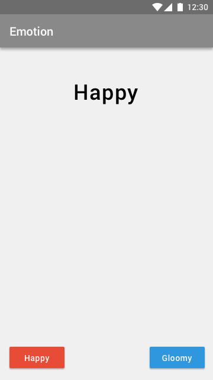

Read and write a string from Firebase
===

Design
---

- Text view: To get the string from Firebase
- Buttons: To change the predifed strings into Firebase

Firebase database tree
---------------------------------

Key    | Value
------ | ---
string | "This is a title."
