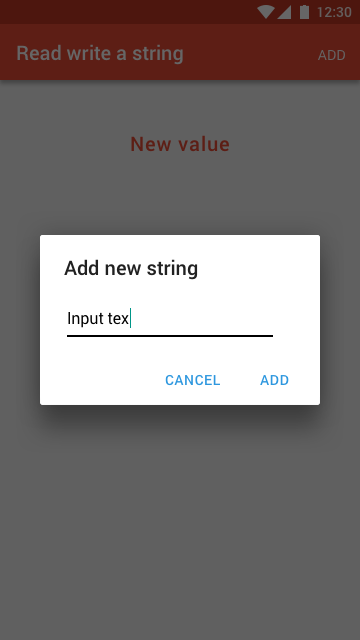

Read and write a string from Firebase with diaglog
===================

Design
-------------

Flow
-------------
1. Click the add button on the app bar
2. Show the dialog to get a new string
3. Refreh the text from Firebase

Firebase database tree
---------------------------------

Key    | Value
------ | ---
string | "This is a title."

Reference for Alert dialog
--------------------------
> - Show custom alert dialog with EditText inside it, [link][1]
> - [안드로이드]텍스트를 넣을 수 있는 다이얼로그를 만들어봅시다. [link][2]

[1]: https://bhavyanshu.me/tutorials/create-custom-alert-dialog-in-android/08/20/2015
[2]: http://growingdever.tistory.com/99