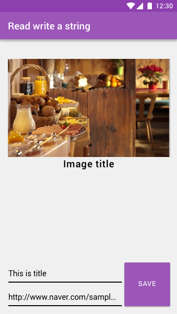

Read and write URL string and load the Image with the URL
===================

Design
-------------

1. Input new text and tap the SAVE button
2. The text shoud be save into the database of Firebase
3. Refresh the text on the textview
