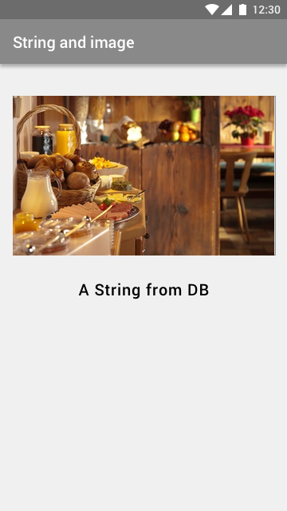

Read URL string and load the Image with the URL
===================

Design
-------------



Flow
-------------

1. String 하나를 읽어와서 보여준다.
2. URL을 가지고 와서 그 URL의 사진을 보여준다.


Firebase database tree
---------------------------------
Key    | Value
------ | ---
string | "This is a title."
url    | "http://www.blahblah.com/image.jpg"


Image 가지고 오기
--------------------------
Glide 라이브러리 이용

####Gradle file에서 아래 추가

```
dependencies {
  compile 'com.github.bumptech.glide:glide:3.7.0'
  ...
}
```


####How to use library
```
  Glide
    .with(this)
    .load(url)
    .into(myImageView);
```
