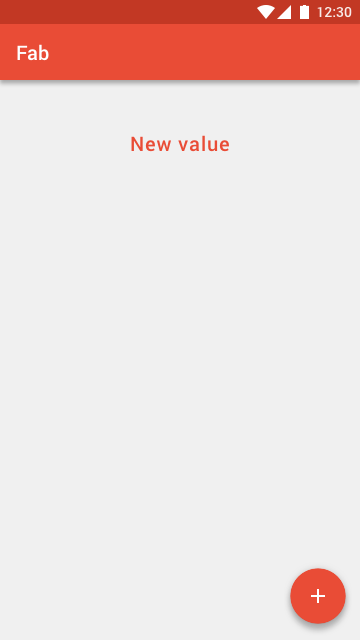
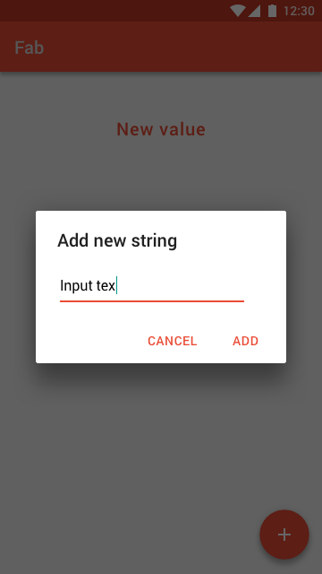

Add a text with FAB
===================

Design
-------------
1. Main

2. Add dialog

Flow
----
1. Tap the Fab
2. Show the dialog to input new text
3. After adding new text, should display on the textview
   (Of course, the text should be saved in the Firebase.)
